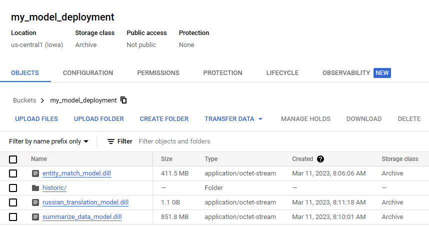

# Model Deployment

Model deployment is the process of taking a trained machine learning model and making it available for use in a real-world application. This involves a variety of steps, including selecting an appropriate deployment environment, preparing the model for deployment, and creating an interface for users to interact with the model. Deploying a model is an important step in the machine learning pipeline, as it is what enables the model to be used to solve real-world problems. Effective deployment requires careful consideration of factors such as scalability, reliability, and security, and can involve the use of specialized tools and platforms to streamline the process.

### Using Inheritance to Standardize HuggingFace Models

Using inheritance in Python is a powerful tool for creating reusable code and standardizing behavior across multiple classes. In the context of deploying Hugging Face models in an application, we can use inheritance to create a ModelWrapper class that standardizes the process of preparing input data and calling the predict method of the Hugging Face model.

The example code for standardizing the models can be found [here](/model_deployment/model_deployment.py)

The ModelWrapper class can take in the specific differences of each Hugging Face model, such as the tokenizer and model architecture, and use them to modify input data in a standardized way. For example, if one Hugging Face model requires the input to be tokenized and encoded before being passed to the model, the ModelWrapper can use the specified tokenizer to perform these actions. Similarly, if another model requires the input to be preprocessed in a specific way, the ModelWrapper can implement the necessary preprocessing steps.

By standardizing the input modification process, the ModelWrapper allows for easy integration of new Hugging Face models into the deployment app. Additionally, by implementing a predict method that calls the predict method of the Hugging Face model, the ModelWrapper hides the specifics of each model's prediction process and allows for a consistent interface to be used in the app.

The Model Dpeloyment proposes serialization using the Dill library, after which the serialized files are uploaded to a GCP bucket.

 "gcp bucket")

## Usage

### Local

### Docker

